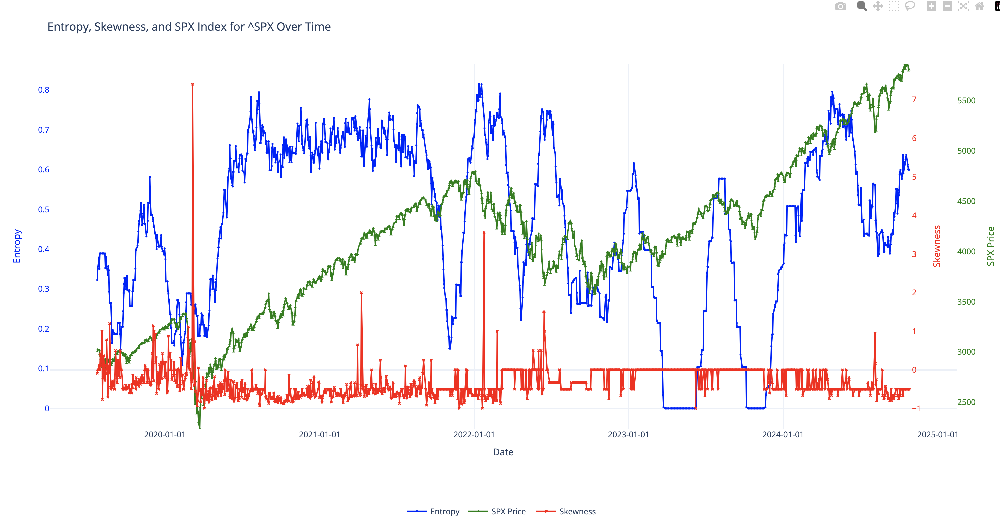
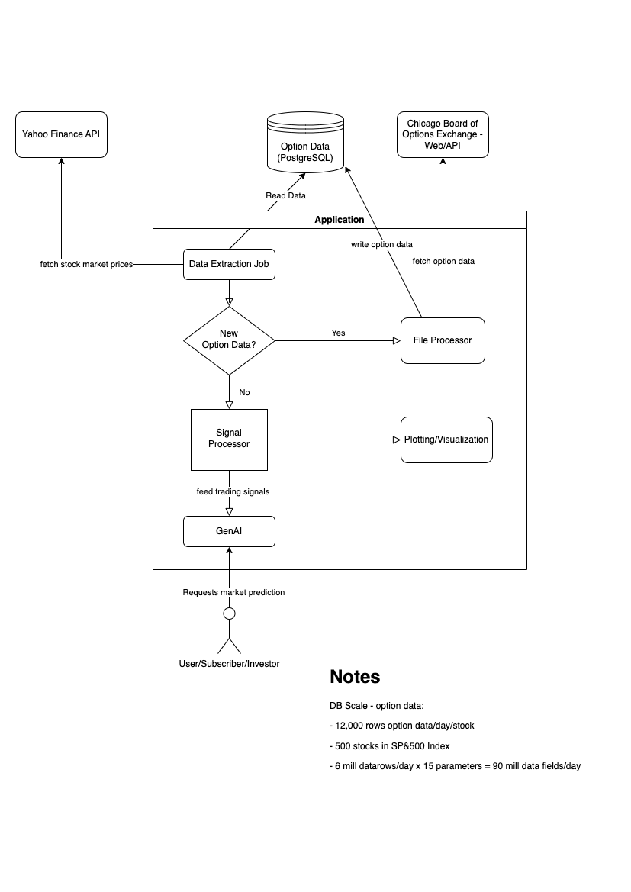

# Syntax_GenAI
## Demo project 

### How to Start and Use Application
Instructions to setup (assumes MacOS)

1. Go to root folder in your terminal
2. Create virtual environment: python3 -m venv gen_ai_venv
3. Activate environment: source gen_ai_venv/bin/activate
4. Install dependences: pip install -r requirements.txt 
5. Run: python 

### The complex problem addressed

How can we provide investment professional subscribers the ability to predict stock market 
drawdowns using GenAI and financial data before they happen so they can protect
their clients' porfolios?

### GenAI frameworks and tools used and the rationale

I used the GenAI tool, DIY, for this demo due to its:
• Customization capabilities in handling various datasets,
• Low overhead as large data and calculations are already time and resource intensive, and, 
• Suitability for well-defined tasks like generating insights from financial signals.

• Trading models require large amounts of data and processing power for the signal calculations

• I need to directly manage the flow of my specific data (like CSV files and PostgreSQL data) into the AI model without needing to adhere to the structure of a rigorous framework

• You avoid the overhead that some frameworks add, allowing you to streamline your code to handle only the essential steps—loading, refining, processing, and feeding data to the model.

### Architecture and Workflow of the Application
Sample data used as input to GenAI tool. The blue line is the signal. The green line is the price of the S&P500 index price. The red line is a proxy of how expensive hedging is in the market.

Architecture of how data is obtained, transformed/processed, and transferred into the GenAI tool.

### Key Challenges

#### Challenges: 
• Generating tradeable signals from financial data is extremely difficult as markets are efficient

• Generating tradeable signals that can be repeatable is even harder

• Understand the limitations of AI. It can NOT predict the future, it can only uncover patterns from history given the data is high quality

• What are the appropriate trading signal(s) such that GenAI tools can uncover patterns (e.g.,
feeding generic closing prices to models may have worked 15 years ago but not in today's market dynamics)

• Understanding where in the process GenAI tools are best used. In my opinion, the best use is in uncovering patterns that are not easily
identifiable to the human eye or through simple statistical processes.

• Challenges in setting up the appropriate prompt and narrowing the scope of the output of the GenAI model so that
the most meaningful output is produced consistently.

• Experienced challenges in parameter use including which model, temperature=0.2, and max_tokens=250 to balance cost with conciseness
and meaningful output.

#### Solutions:

• Relied on existing academic publications in physics, mathematics, statistics and quantitative finance
to generate reliable and consistent trading signals. This was significant time investment and difficult to replicate - I believe this is
a large value add and creates the highest quality input data for the GenAI model. 

• Required significant experimentation to determine the best model to use. Eventually I settled on gpt-4o-mini as it was most cost-effective
and still generated meaningful output consistently. 

• Experimentaion also led to a temperature parameter of 0.2 to ensure reliable, consistent answers with less variability. 
With financial data, predictability, consistency and accuracy are critical at a tradeoff for more creative answers seen in higher parameter values.  

### Business opportunity:

• Existing services charge up US$700/mo/subscriber to provide meaningful trading signals from data but they are not interactive and you can't ask questions
(e.g., https://squeezemetrics.com/monitor/dix)